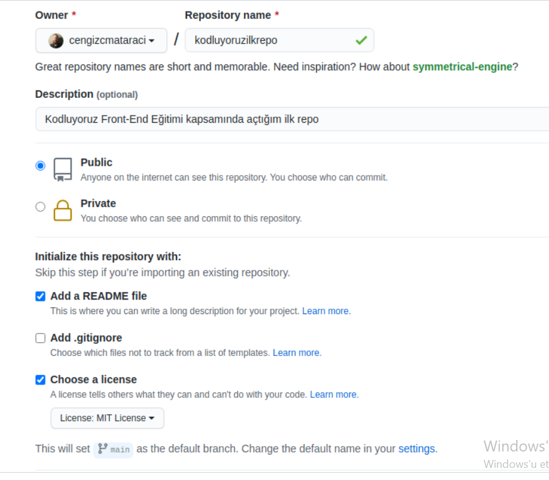

# kodluyoruzilkrepo
Kodluyoruz Eğitimi kapsamında açtığım ilk repo
Bu repo Kodluyoruz Front-End Eğitiminde oluşturduğumuz ilk repo. İçerisinde bir adet README dosyası, bir adet de index.html barındırıyor.



# Installation
---------------------------------------------------------------
Oncelikle projeyi clonelayin (Buraya sizin reponuzdan aldiginiz link gelecek)

`git clone https://github.com/cengizcmataraci/kodluyoruzilkrepo.git`

# Usage
---------------------------------------------------------------

Projeyi cloneladıktan sonra Visual Studio Code programında açınız.

Linux icin:

``` cd kodluyoruzilkrepo code .``` 
# Contributing
---------------------------------------------------------------
Pull requestler kabul edilir. Büyük değişiklikler için, lütfen önce neyi değiştirmek istediğinizi tartışmak için bir konu açınız.

# Licence
---------------------------------------------------------------
 [MIT]()
